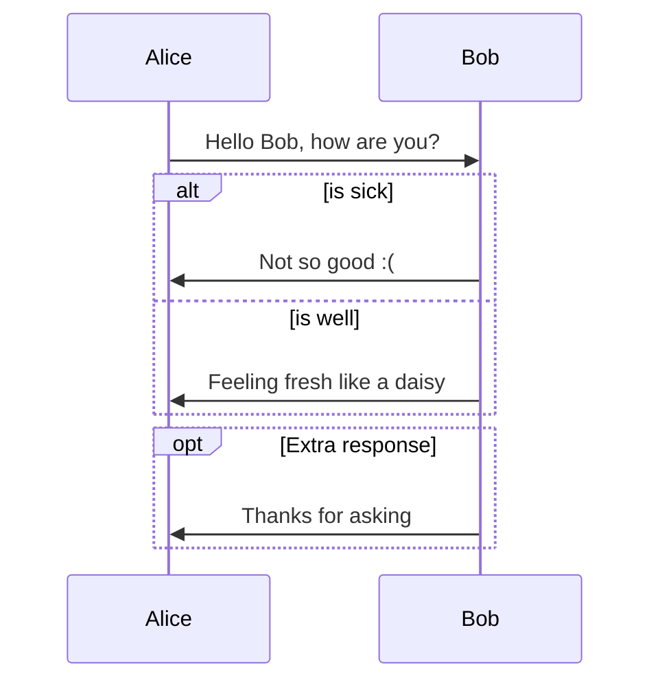
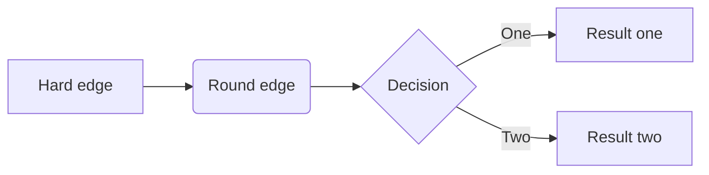
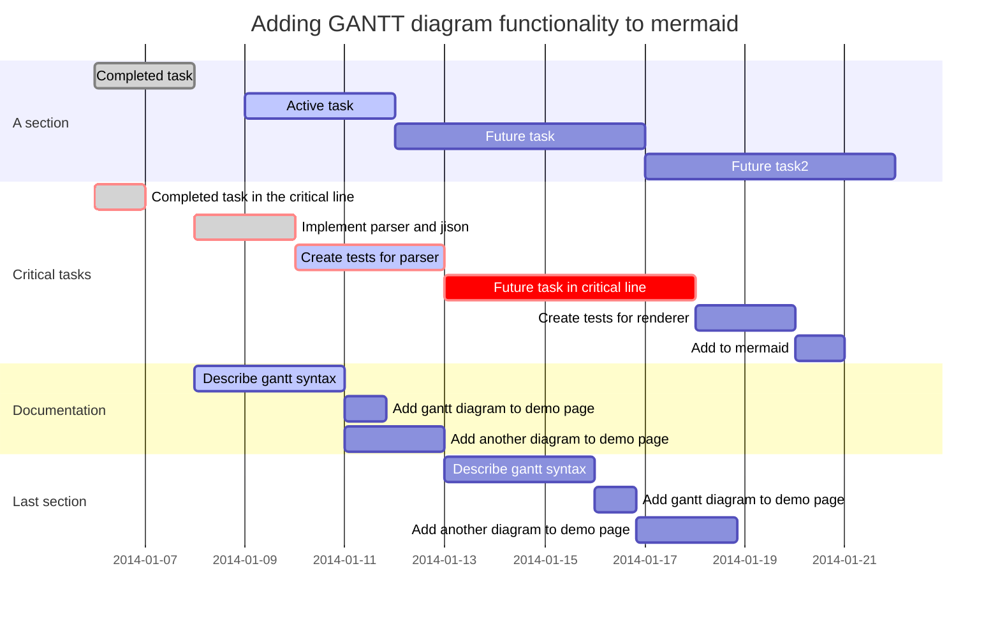
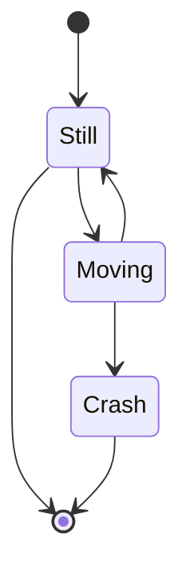
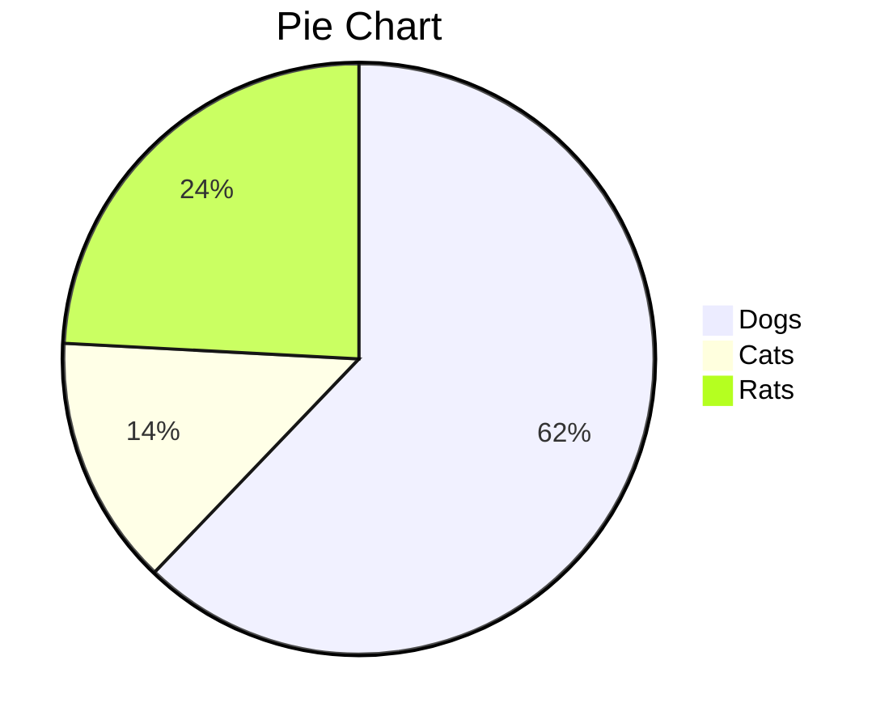
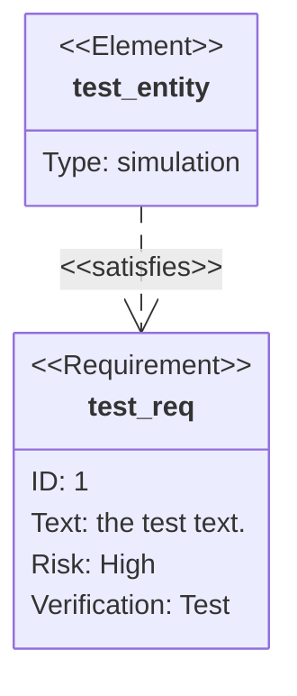
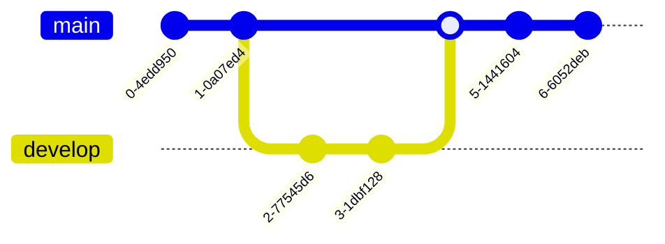

2022 年 9 月 5 日 作者： typora.io

## 前提

Typora 支持一些图表的 Markdown 扩展，要使用此功能，**请首先在首选项面板 → Markdown 部分中启用图表**。

导出为 HTML、PDF、epub、docx 时，这些渲染的图表也会包含在内，但当前版本导出 Markdown 为其他文件格式时不支持图表功能。此外，您还应该注意到，标准 Markdown、CommonMark 或 GFM 不支持图表。因此，我们仍然建议您插入这些图表的图片，而不是直接用 Markdown 编写它们。

## 序列图

该功能使用[js-sequence](https://bramp.github.io/js-sequence-diagrams/)，它将以下代码块转换为渲染图：

```
```sequence
Alice->Bob: Hello Bob, how are you?
Note right of Bob: Bob thinks
Bob-->Alice: I am good thanks!
```
```


欲了解更多详细信息，请参阅[此语法解释](https://bramp.github.io/js-sequence-diagrams/#syntax)。

### 序列图选项

您可以更改 CSS 变量`--sequence-theme`来设置序列图的主题，支持的值是`simple`(默认) 和`hand`。例如，在[自定义 CSS](https://support.typora.io/Add-Custom-CSS/)中添加以下 CSS ，您将获得：

```
:root {
  --sequence-theme: hand
}
```

| –序列主题：简单 | –序列主题：手 |
| --- | --- |
|  |  |

# 流程图

此功能使用[diagram.js](http://flowchart.js.org/)，它将以下代码块转换为渲染图：

```
```flow
st=>start: Start
op=>operation: Your Operation
cond=>condition: Yes or No?
e=>end

st->op->cond
cond(yes)->e
cond(no)->op
```
```


# 美人鱼

[Typora 还与mermaid](https://mermaid-js.github.io/mermaid/#/)集成，支持序列图、流程图、甘特图、类和状态图以及饼图。

## 序列图

有关更多详细信息，请参阅[这些说明](https://mermaid.js.org/syntax/sequenceDiagram.html)。

```

```


## 流程图

有关更多详细信息，请参阅[这些说明](https://mermaid.js.org/syntax/flowchart.html)。

```

```


## 甘特图

有关更多详细信息，请参阅[这些说明](https://mermaid.js.org/syntax/gantt.html)。

```

```


## 类图

有关更多详细信息，请参阅[这些说明](https://mermaid.js.org/syntax/classDiagram.html)。

```
```mermaid
classDiagram
      Animal 

## 状态图

有关更多详细信息，请参阅[这些说明](https://mermaid.js.org/syntax/stateDiagram.html)。

```

```


## 饼图

```

```


## 需求图

需求图提供了需求及其相互之间以及其他已记录元素之间的连接的可视化。建模规范遵循 SysML v1.6 定义的规范。

您可以[在此处](https://mermaid-js.github.io/mermaid/#/requirementDiagram)找到详细信息。

```

```


## Gitgraph 图表/提交流程

Git Graph 是各个分支上 git 提交和 git 操作（命令）的图形表示。

您可以[在此处](https://mermaid.js.org/syntax/gitgraph.html)找到详细信息。

```

```


## C4 图表（兼容 plantUML）

Mermaid 的 c4 图语法与 plantUML 兼容。

您可以[在此处](https://mermaid.js.org/syntax/c4c.html)找到详细信息。

## 思维导图

思维导图是一种图表，用于将信息以层次结构直观地组织起来，显示整体各部分之间的关系。它通常围绕一个概念创建，以图像的形式绘制在空白页的中心，并在其中添加相关的想法表示，例如图像、单词和单词的部分。主要想法直接与中心概念相关，其他想法从这些主要想法中分支出来。

您可以[在此处](https://mermaid.js.org/syntax/mindmap.html)找到详细信息。

```
```mermaid
mindmap
  root((mindmap))
    Origins
      Long history
      ::icon(fa fa-book)
      Popularisation
        British popular psychology author Tony Buzan
    Research
      On effectiveness
and features
      On Automatic creation
        Uses
            Creative techniques
            Strategic planning
            Argument mapping
    Tools
      Pen and paper
      Mermaid
```
```


## 时间线

详情请参阅[https://mermaid.js.org/syntax/timeline.html 。](https://mermaid.js.org/syntax/timeline.html)


## 象限图

有关详细信息，请参阅[https://mermaid.js.org/syntax/quadrantChart.html](https://mermaid.js.org/syntax/quadrantChart.html) 。


## 桑基图

 详情请参阅[https://mermaid.js.org/syntax/sankey.html 。](https://mermaid.js.org/syntax/sankey.html)


## 禅宗UML

 详情请参阅[https://mermaid.js.org/syntax/zenuml.html 。](https://mermaid.js.org/syntax/zenuml.html)


请注意，zenuml 不是 mermaid 中的第一类图表，它可能缺少一些功能，例如黑暗主题等。

## XY 图表

您可以在此处找到更多详细信息→[https://mermaid.js.org/syntax/xyChart.html。](https://mermaid.js.org/syntax/xyChart.html%E3%80%82)

您现在可以绘制如下图表：


## 全球美人鱼选项

### 概述

[您可以通过添加自定义 CSS](https://support.typora.io/Add-Custom-CSS/)来更改 Mermaid 选项，支持的选项包括：

```
:root {
  --mermaid-theme: default; /*or base, dark, forest, neutral, night */
  --mermaid-font-family: "trebuchet ms", verdana, arial, sans-serif;
  --mermaid-sequence-numbers: off; /* or "on", see https://mermaid-js.github.io/mermaid/#/sequenceDiagram?id=sequencenumbers*/
  --mermaid-flowchart-curve: linear /* or "basis", see https://github.com/typora/typora-issues/issues/1632*/;
  --mermaid--gantt-left-padding: 75; /* see https://github.com/typora/typora-issues/issues/1665*/
}
```

请注意，如果您使用当前使用的主题以外的其他主题导出文档，则某些 Mermaid 选项将不会应用于导出的 HTML / PDF / 图像。例如，如果您当前在 Github 中使用它们，但在导出为 PDF 时，您为 PDF 导出设置了主题 YYY，并且 YYY.css 定义了`--mermaid-sequence-numbers: on`，则`--mermaid-sequence-numbers: on`不会应用于导出的 PDF。

### 图表对齐

您可以按照添加自定义 CSS[添加以下自定义 CSS，](https://support.typoraio.cn/Add-Custom-CSS/)以使图表左对齐。

```
.md-diagram-panel-preview {text-align:left;}
```

### 美人鱼主题

增加了css变量，`--mermaid-theme`可以快速定义一个适合你主题的美人鱼主题，值可以是`base`，`default`，`dark`，，（夜间主题使用的那个），例如：`forest``neutral``night`

| CSS | 美人鱼演示 |
| --- | --- |
| `:root {--mermaid-theme:dark;}` |  |
| `:root {--mermaid-theme:neutral;}` |  |
| `:root {--mermaid-theme:forest;}` |  |

### 自动编号

添加`--mermaid-sequence-numbers: on;`自[定义 CSS](https://support.typora.io/Add-Custom-CSS/)将启用美人鱼序列的自动编号：

| –美人鱼序列号：关闭 | –美人鱼序列号：on |
| --- | --- |
|  |  |

### 流程图曲线

添加`--mermaid-flowchart-curve: basis`以获取其他类型的曲线。

| –mermaid-flowchart-curve：线性； | –mermaid-flowchart-curve：基础 | –美人鱼流程图曲线：自然； | –mermaid-flowchart-curve：步骤； |
| --- | --- | --- | --- |
|  |  |  |  |

### 甘特图填充

| –美人鱼–gantt-左填充：75 | –美人鱼–gantt-left-padding：200 |
| --- | --- |
|  |  |

## 内联美人鱼配置

您可以`%%{init: [options]}%%`在美人鱼图的第一行添加配置美人鱼的详细信息，如下所示：


[您可以在https://mermaid-js.github.io/mermaid/#/./directives](https://mermaid-js.github.io/mermaid/#/./directives)找到完整文档。

# 另存为/复制图表

您可以右键单击图表将其保存为 SVG、PNG 或 JPG 文件到本地磁盘。

另外，您可以右键单击图表将其复制到剪贴板中。

[获取 Typora](https://typoraio.cn/) / [帮助改进我们的文档](https://github.com/typora/wiki-website)

[← 下一篇 【WinForm】琉璃猫开发计划](/posts/winform-ruricatplan/)

[【MySql】配置项说明 上一篇 →](/posts/mysql-doc/)

